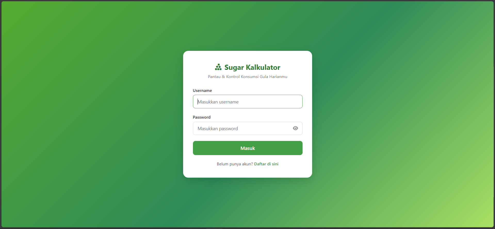
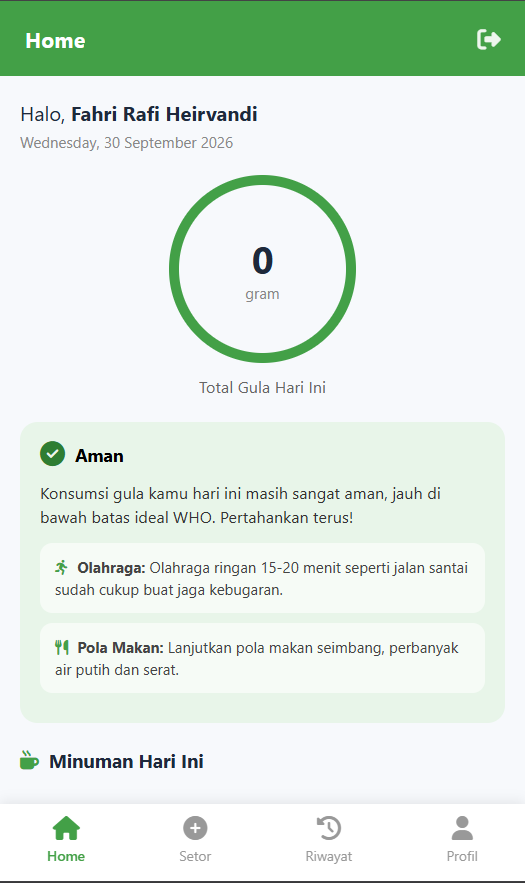
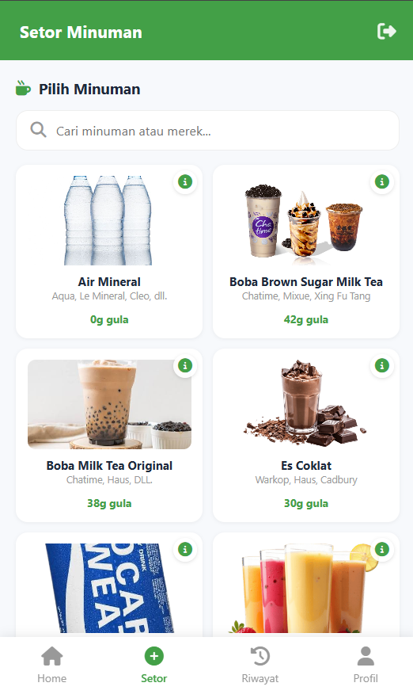
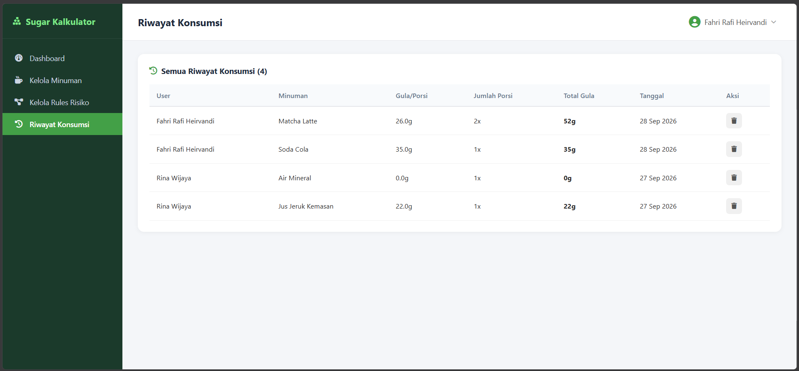
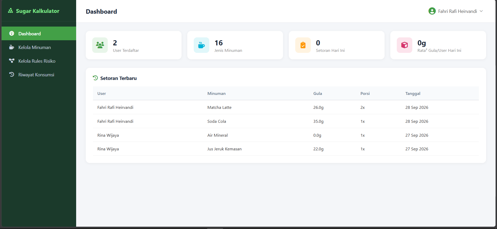
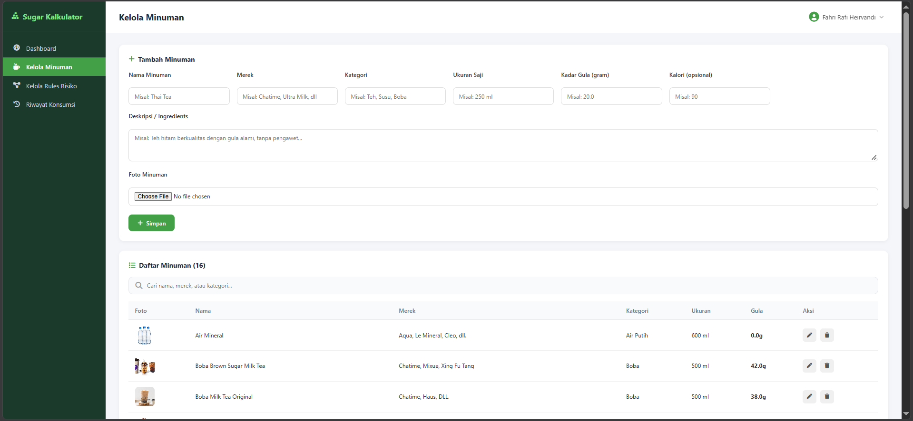
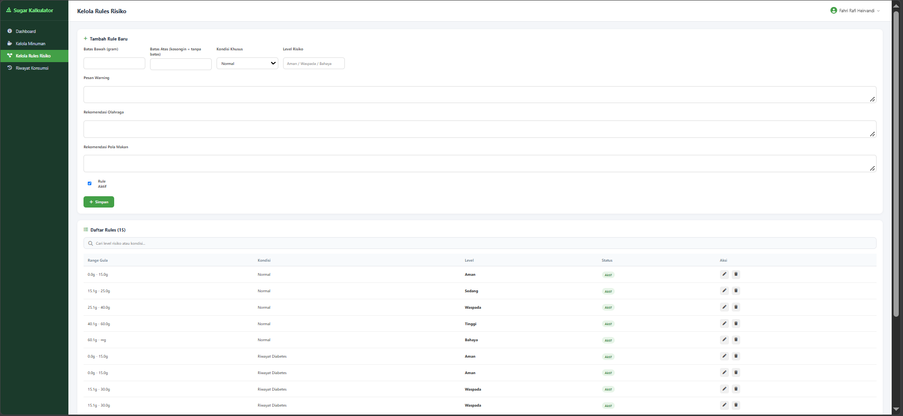

# 🍹 Sugar Kalkulator

Aplikasi web untuk menghitung asupan gula harian dari minuman kemasan. Pengguna mencatat minuman yang dikonsumsi, lalu sistem menghitung total gula hari itu, menampilkan **level risiko** (Aman / Waspada / Bahaya), dan memberi rekomendasi olahraga serta pola makan yang disesuaikan dengan kondisi pengguna (normal atau riwayat diabetes).

> Proyek ini dibuat dengan **PHP native** dan **MySQL**, tanpa framework.

## 📸 Screenshot

<!-- Ganti dengan screenshot aplikasimu. Lihat petunjuk di bawah README ini. -->
| Halaman Login | Beranda User | Setor Minuman |
|---|---|---|
|  |  |  |

| Riwayat | Dashboard Admin |
|---|---|
|  |  |

| Kelola Minuman | Kelola Rules |
|---|---|
|  |  |

## ✨ Fitur

### Untuk pengguna
- Registrasi dan login dengan password ter-hash
- Katalog minuman lengkap dengan gambar, ukuran saji, kadar gula, kalori, dan komposisi
- Mencatat konsumsi minuman beserta jumlah porsi
- Total gula harian dan level risiko otomatis berdasarkan aturan (rules)
- Rekomendasi olahraga dan pola makan sesuai level risiko
- Riwayat konsumsi, dengan opsi hapus
- Profil: data diri (berat badan, usia, riwayat diabetes), foto profil, dan ganti password

### Untuk admin
- Dashboard ringkasan: jumlah user, jenis minuman, setoran hari ini, dan rata-rata gula per user
- Kelola data minuman (tambah, ubah, hapus, upload gambar)
- Kelola rules risiko (batas gula, kondisi khusus, pesan peringatan, rekomendasi, status aktif)
- Melihat dan menghapus semua riwayat konsumsi
- Pengaturan akun admin

## 🛠️ Teknologi

- **PHP** (native, MySQLi dengan prepared statement)
- **MySQL / MariaDB**
- **HTML & CSS** (desain kustom)
- **Font Awesome** dan **SweetAlert2** (via CDN)

## 🔐 Keamanan

- Password disimpan dengan `password_hash()` dan diverifikasi dengan `password_verify()`
- Query memakai prepared statement untuk mencegah SQL injection
- Halaman dibedakan berdasarkan role (admin dan user) lewat session

## 🚀 Cara Menjalankan (XAMPP)

1. Pastikan **XAMPP** sudah terpasang, lalu jalankan **Apache** dan **MySQL**.
2. Clone repo ini ke folder `htdocs`:
   ```bash
   cd C:\xampp\htdocs
   git clone https://github.com/fahrirafiheirvandi/sugar-kalkulator.git
   ```
3. Buka **phpMyAdmin** (`http://localhost/phpmyadmin`), buat database baru bernama `sugar_kalkulator_db`, lalu **Import** file `database/sugar_kalkulator_db.sql`.
4. Cek pengaturan koneksi di `config.php` (bawaan XAMPP: user `root`, password kosong).
5. Buka `http://localhost/sugar-kalkulator` di browser.

## 🔑 Akun Demo

| Role | Username | Password |
|---|---|---|
| Admin | `admin` | `admin123` |
| User | `Fahri` | `fahri123` |

> Kamu juga bisa membuat akun baru lewat halaman **Register**.

## 📁 Struktur Folder

```
sugar-kalkulator/
├── admin/          # Halaman admin (dashboard, minuman, rules, konsumsi, akun)
├── user/           # Halaman user (beranda, setor minuman, riwayat, profil)
├── assets/         # File CSS
├── database/       # File SQL database
├── uploads/        # Gambar minuman dan foto profil
├── config.php      # Koneksi database
├── index.php       # Redirect ke halaman login
├── login.php
├── register.php
└── logout.php
```

## 👤 Pembuat

**Fahri Rafi Heirvandi**
- GitHub: [@fahrirafiheirvandi](https://github.com/fahrirafiheirvandi)
- Portofolio: [fahrirh-portofolio.netlify.app](https://fahrirh-portofolio.netlify.app/)
